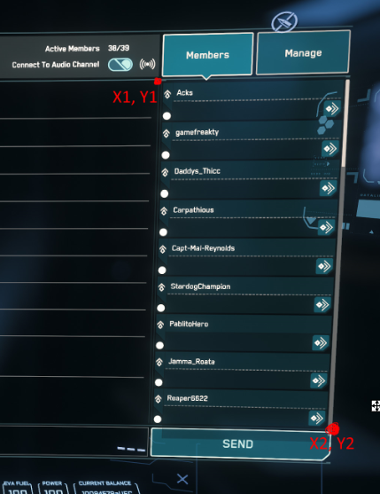

# pyHountyBunter
===================================

The Image Username Detector is a Python script that uses the PIL (Python Imaging Library) and pytesseract libraries to extract text from a set of images and search for specific usernames in the extracted text. The script prompts the user to select a folder containing the images and a dictionary file containing the usernames to search for. It also uses a configuration file to save the file paths for future use.

### Prerequisites
-------------

*   Python 3.x
*   Tesseract OCR binary
*   PIL (Python Imaging Library)
*   pytesseract
*   tkinter
*   json
*   os

### Installation
------------

1.  Clone or download the `pyHountyBunters` repository.
2.  Install the necessary libraries by running the following command in the terminal:

`pip install -r requirements.txt`

3.  Install the Tesseract OCR binary. Instructions on how to do so can be found on the [Tesseract Wiki](https://github.com/tesseract-ocr/tesseract/wiki).
    
    *   For Windows users, download the Tesseract OCR binary installer from the [UB Mannheim website](https://github.com/UB-Mannheim/tesseract/wiki).
    *   For Mac users, run the following command in the terminal:
    
    `brew install tesseract`
    
    *   For Linux users, run the following command in the terminal:
    
    `sudo apt install tesseract-ocr`
    

### Usage
-----

1.  Open the terminal and navigate to the directory where the `hounty.py` file is located.
2.  Run the following command to execute the script:

`python hounty.py`

3.  Follow the prompts to select a folder containing image files and a dictionary file containing the usernames to search for.

### Important Note

The code assumes that the area to be cropped from the image is known, and that the cropping coordinates are fixed. This means that the code may not work correctly with images of different resolutions or aspect ratios.

To ensure that the code works correctly with your images, it's necessary to edit the cropping coordinates based on the resolution and aspect ratio of the images being processed. The specific coordinates will depend on the location and size of the area containing the text information to be extracted.

We recommend that users carefully review the code and adjust the cropping coordinates to match the area containing the text in their specific images. This can be done by modifying the values of `x1`, `y1`, `x2`, and `y2` in the `image.crop()` method.

### Sample Output
-------------

### Contributing
------------

Contributions are welcome! Please feel free to open a pull request or submit an issue.

### License
-------

This project is licensed under the MIT License. See the [LICENSE](LICENSE) file for more information.